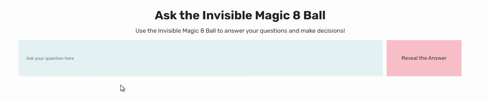

## Magic 8 Ball

Live Site URL: [Magic 8 Ball](https://garliccoder.github.io/magic-8-ball/)

### Table of Contents
- [Descripton](#description)
- [My Process](#my-process)
- [Author](#author)
- [Acknowledgements](#acknowledgments)

## **Description**:
A page where you can ask any yes/no questions to help you make decisions!

## **My Process:**
I followed a Javascript tutorial from [Codedex.io](https://www.codedex.io/) to create a Magic 8 Ball through the Console. I wanted to be able to use it outside the Console so I tried recreating it into a Web Page!

**Coding Language**: HTML, CSS, Javascript

## **Author:**
@GarlicCoder - Amateur Coder, Garlic Lover

[Github.com/GarlicCoder](https://github.com/GarlicCoder/)

## **Acknowledgments:**
CodeDex: [Magic 8 Ball Tutorial](https://www.codedex.io/javascript/15-magic-8-ball) 

Mitchum: [How to Build A Magic Eight Ball With Javascript](https://mitchum.blog/how-to-build-a-magic-eight-ball-with-javascript/)
